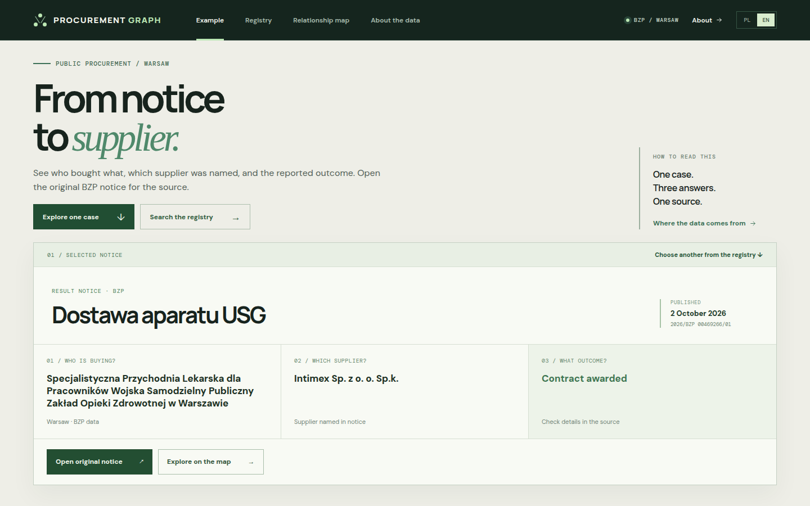
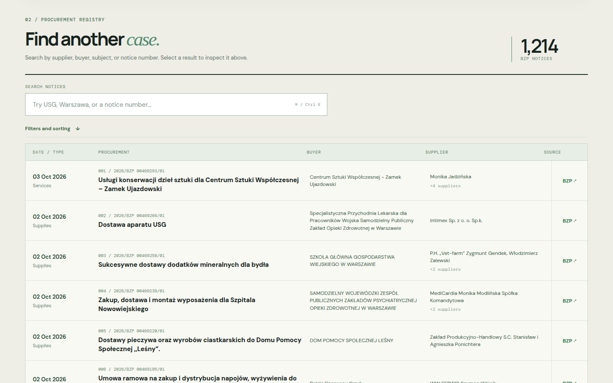
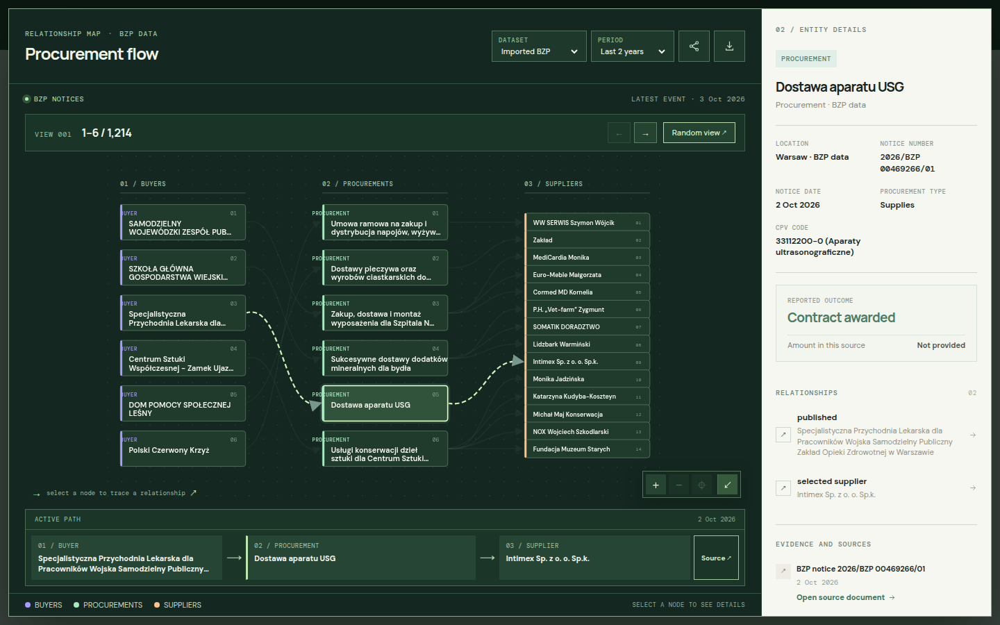
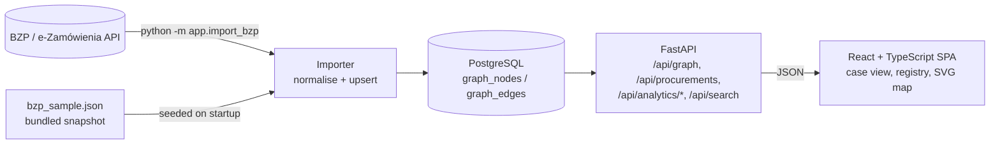

# Procurement Graph

**Trace a Polish public procurement notice from buyer to supplier, with a link back to the official source.**

[](https://github.com/MaciejZiel/procurement-graph/actions/workflows/ci.yml)
[](LICENSE)




Procurement Graph turns a result notice from BZP (Poland's public procurement bulletin) into a readable case: what was bought, who bought it, which supplier was named, what outcome was reported, and where the original notice can be checked. It ships with a snapshot of 1,214 real result notices from Warsaw buyers (published September 1 – October 3, 2026) and a separate set of fictional demo records. The interface opens in Polish and has an English switch.

## What it does

- **Case view** – one notice answered as three questions: who is buying, which supplier was named, what the outcome was, plus a link to the original BZP notice.
- **Registry** – searchable (diacritics-insensitive), sortable and filterable list of all notices with pagination.
- **Analytics** – top buyers and suppliers by contract value or number of notices, supplier concentration per buyer (HHI and share of the largest supplier), single-bid rate and weekly or monthly trends. Computed in SQL (CTEs and window functions) and served by typed endpoints under `/api/analytics/*`.
- **Relationship map** – buyers → procurements → suppliers drawn as a custom SVG graph; every connection shows the notice it comes from.
- **BZP importer** – a CLI that pulls result notices from the official e-Zamówienia API with city/date filters, handles multiple suppliers per notice, and can be re-run safely.
- **Read-only REST API** – FastAPI with OpenAPI docs at `/docs`.

| Registry | Relationship map |
| --- | --- |
|  |  |

## Architecture



Data is stored as a small property graph in two relational tables: `graph_nodes` (institution, procurement, company) and `graph_edges` (published, selected supplier). Each edge carries its evidence: source label, notice URL, date and amount when available. A third table, `procurement_facts`, holds one typed row per notice (number of offers, contract value, signing date, procedure kind, city) for the analytics queries.

The BZP list endpoint returns the figures that matter for analytics (offers received, contract value, signing date) only inside each notice's `htmlBody`. The importer reads them from the numbered form fields (`6.1` offers, `8.1` signing date, `8.2` contract value, per part) and stores them under `extracted`; amounts in other currencies are skipped, and for joint bids the part value is attributed to the first listed contractor.

## Tech stack

- **Backend:** Python 3.11+, FastAPI, SQLAlchemy 2, psycopg 3, httpx
- **Database:** PostgreSQL 17 (Docker Compose); SQLite for local development and tests
- **Frontend:** React 19, TypeScript, Vite, hand-written SVG graph (no graph library)
- **Tooling:** pytest, ruff, Docker Compose, GitHub Actions

## Quick start

With Docker:

```bash
cp .env.example .env
docker compose up --build
```

- App: http://localhost:5173
- API docs: http://localhost:8000/docs (the frontend reaches the API through the Vite proxy)

The bundled BZP snapshot and the demo dataset are loaded automatically on the first start.

Without Docker (uses SQLite in the ignored `data/` directory):

```bash
uv venv backend/.venv
uv pip install --python backend/.venv/bin/python -e 'backend[dev]'
cd frontend && npm ci
npm run dev
```

`npm run dev` starts both the API (port 8000) and the Vite dev server (port 5173).

### Importing more notices

```bash
docker compose exec backend python -m app.import_bzp --city Warszawa --since 2026-09-01
```

Without `--since`, the importer requests Warsaw result notices (`TenderResultNotice`) from the last two years. It also accepts `--notice-type`, `--page-size` (up to 500), `--max-pages` (default 10), or a local JSON file via `--input /app/data/bzp.json`, and reports when it hits the page limit. The demo and BZP datasets are kept apart (`dataset=demo` and `dataset=live`).

## Tests

```bash
cd backend
.venv/bin/pytest -q          # 11 tests
.venv/bin/ruff check . && .venv/bin/ruff format --check .
```

The tests cover the graph API (one-hop search, date windows), the paginated registry with filters, the demo seed, and the BZP importer (response envelopes, normalisation of the official notice shape, idempotent re-import). They run against in-memory SQLite. CI runs the backend lint and tests, plus the frontend type check and build, on every push and pull request.

## Key technical decisions

- **A graph model on top of a relational database.** The domain is naturally a graph (buyer → procurement → supplier), but the queries are simple one-hop traversals over a few thousand rows. Two tables in PostgreSQL avoid running a separate graph database, and SQLAlchemy keeps the same models working on SQLite for tests and local development.
- **Evidence on every edge.** A connection exists only if a notice reports it, and the edge stores the notice number, URL and date. A supplier edge is created only when the source names that supplier. The UI never infers relationships, which matters for data that could be misread as an accusation.
- **Idempotent, deterministic imports.** Node IDs come from the tax ID when present, or from a normalised (casefolded, diacritics-stripped) name hashed with SHA-256. Rows are written with `session.merge`, so re-running the importer over overlapping dates updates records instead of duplicating them.
- **Bundled snapshot instead of a live dependency.** The app seeds a fixed, dated snapshot of real notices on startup, so it is usable offline and in a demo without hitting the government API. Live imports are an explicit CLI step.

## Limitations / next steps

- The graph and registry endpoints load the selected dataset into memory and filter in Python. This is fine for ~1.2k notices but would need SQL-side filtering, indexes and full-text search for a nationwide dataset.
- The schema is created with `create_all` at startup; there are no migrations (Alembic would be the next step).
- Scope is result notices from Warsaw buyers. The BZP field mapping was checked against a real API response but should be re-checked before relying on it in production.
- No frontend tests yet; the frontend is covered only by the TypeScript build.

## Data and interpretation

The source is the [BZP service of Poland's e-Zamówienia platform](https://ezamowienia.gov.pl/pl/integracja/), accessed through its [public endpoint](https://ezamowienia.gov.pl/mo-board/api/v1/notice). Suppliers may be based anywhere. A missing amount or supplier means the source does not provide that field. The map shows relationships reported in notices and does not assess wrongdoing or legal compliance. Names and notice titles stay in their original Polish.

## License

The source code is released under the MIT License, see [LICENSE](LICENSE). Imported BZP data remains subject to the terms of its source.
