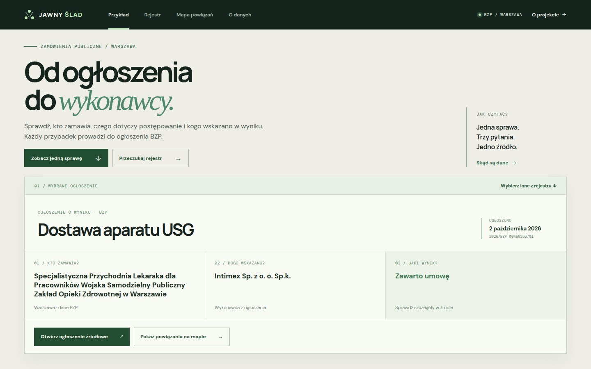

# Procurement Graph

**Trace a public procurement notice from buyer to supplier.**

Procurement Graph turns a result notice into a readable case: what was bought, who bought it, which supplier was named, what outcome was reported, and where the original notice can be checked. The registry lets you find another case. The relationship map is an optional view for exploring connected records.



The app opens in Polish and includes an English language switch. It uses a bundled snapshot of 1,214 real result notices from Warsaw buyers, published between September 1 and October 3, 2026. This is a fixed snapshot, not a live feed. A separate demo dataset contains fictional records. Names and notice titles from the Polish source remain in their original language.

## Features

- A case view with buyer, supplier, reported outcome, and a link to the original BZP notice.
- A searchable, sortable registry with filters and pagination.
- A relationship map showing buyers, procurements, and suppliers, with source evidence for each connection.
- Guided paths through fictional demo records.
- A read-only FastAPI backend and PostgreSQL storage in Docker Compose.
- A BZP importer that supports city and date filters, multiple suppliers per notice, and repeatable imports.

## Run locally

Docker and Compose are required for the container setup:

```bash
cp .env.example .env
docker compose up --build
```

The frontend is available at `http://localhost:5173`; API documentation is at `http://localhost:8000/docs`.

For local development without Docker:

```bash
uv venv backend/.venv
uv pip install --python backend/.venv/bin/python -e 'backend[dev]'
cd frontend && npm ci
npm run dev
```

The local development command starts both servers and uses SQLite in the ignored `data/` directory. Docker Compose uses PostgreSQL.

To import more BZP notices after starting Compose:

```bash
docker compose exec backend python -m app.import_bzp --city Warszawa --since 2026-09-01
```

Without `--since`, the importer requests Warsaw result notices (`TenderResultNotice`) from the official API for the last two years. It also accepts `--notice-type`, `--page-size` (up to 500), `--max-pages` (default 10), or a local JSON file via `--input /app/data/bzp.json`. The importer reports when it reaches the page limit. A supplier connection is created only when the source names that supplier. The demo and BZP datasets are separate (`dataset=demo` and `dataset=live`).

## Data and interpretation

The source is the [BZP service of Poland's e-Zamówienia platform](https://ezamowienia.gov.pl/pl/integracja/). The current scope covers notices from Warsaw buyers; suppliers may be based anywhere. A map connection records a relationship reported in a notice. A missing amount or supplier means the available data does not provide that field. The map does not assess wrongdoing or legal compliance.

The importer uses the [public BZP endpoint](https://ezamowienia.gov.pl/mo-board/api/v1/notice). Its mapping was checked against a real API response; the provider format should be checked again before production use.

## Stack

- **Frontend:** React, TypeScript, Vite, custom SVG graph.
- **Backend:** Python, FastAPI, SQLAlchemy.
- **Database:** PostgreSQL in Compose; SQLite for local development.

## License

The source code is released under the MIT License, see [LICENSE](LICENSE). Imported BZP data remains subject to the terms of its source.
